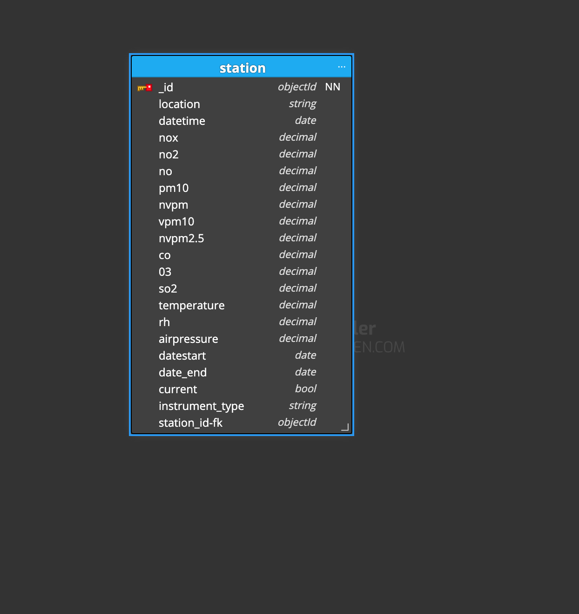
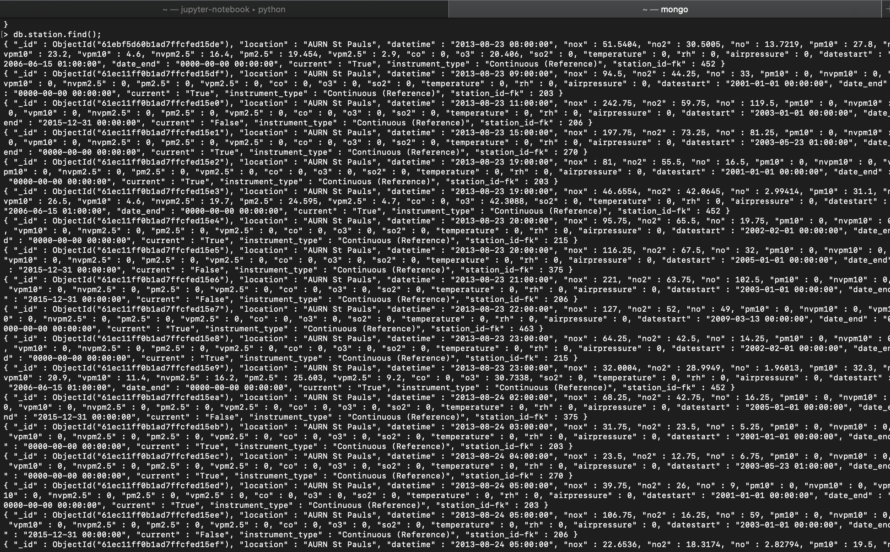
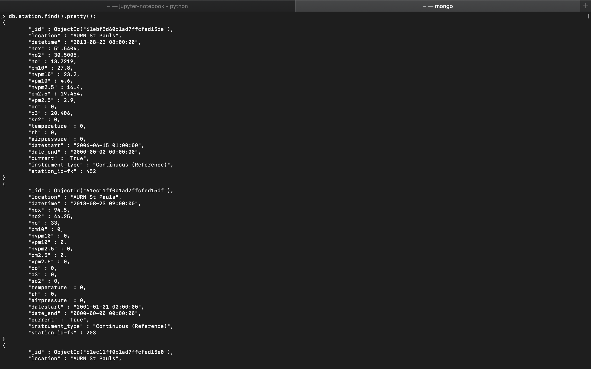

# Report on modelling, Implementing and querying with MongoDB 
**Why MongoDB as my choice of NoSQL database ?** 
MongoDB is one of the most used NoSQl data base because it is built on a scale-out architecture that has become popular with developers of all kinds for developing scalable applications with evolving data schemas. 

MongoDB is built on a scale-out architecture that has become popular with developers of all kinds for developing scalable applications with evolving data schemas.

As a document database, MongoDB makes it easy for developers to store structured or unstructured data. It uses a JSON-like format to store documents. This format directly maps to native objects in most modern programming languages, making it a natural choice for developers, as they don’t need to think about normalizing data. MongoDB can also handle high volume and can scale both vertically or horizontally to accommodate large data loads.

MongoDB was built for people building internet and business applications who need to evolve quickly and scale elegantly. Companies and development teams of all sizes use MongoDB for a wide variety of reasons. 

 MongoDB has grown to be one of the most searched databases in the world. This allows developers to easily store, manage, and retrieve data while building applications using most programming languages.

## Model, Implement and query  
The schema model will show the structure of the specific station in this case "AURN St Paul" to be implemented 

From my macOS terminal I installed MongoDB with brew with the command `brew tap mongodb/brew` followed by the enter button to install the ability and capability to install MongoDB, then followed by the command `brew install monogodb-community@4.2` to install MongoDB. 

The installation includes: 
1. The mongod server,
2. The mongos sharded cluster query router,
3. The mongo shell. 
 

Finally, to run MongoDB the commannd `brew services start mongodb-community@4.2` starts the MongoDB server and `mongo` starts the mongo shell. 
To check list of database `show dbs` and I created a database called **my readings**, to check the database being used `db` . I created a user `db.createUser({user: "Oladimeji", 
                 pwd:"1234", 
               roles:["readWrite","dbAdmin"]});`.

I created a collection called "station" with the function `db.createCollection("station");` and the command to show the collection created is `show collections`. The specific monitor database I chose to model is "AURN ST Pauls" which I created manually by inputing data from mysql query `
select stations.location, readings.* from stations,readings 
where stations.location = 'AURN St Pauls'; ` that returned the readings for the specified monitor. 

To insert the readings recorded to the collection "station" from the mongo shell using the insert.Many() command to insert each rows from the table from the query above showing the readings for "AURN St Pauls" for example `db.station.insert.Many([{
		"location" : "AURN St Pauls",
		"datetime" : "2013-08-23 08:00:00",
		"nox" : 51.5404,
		"no2" : 30.5005,
		"no" : 13.7219,
		"pm10" : 27.8,
		"nvpm10" : 23.2,
		"vpm10" : 4.6,
		"nvpm2.5" : 16.4,
		"pm2.5" : 19.454,
		"vpm2.5" : 2.9,
		"co" : 0,
		"o3" : 20.406,
		"so2" : 0,
		"temperature" : 0,
		"rh" : 0,
		"airpressure" : 0,
		"datestart" : "2006-06-15 01:00:00",
		"date_end" : "0000-00-00 00:00:00",
		"current" : "True",
		"instrument_type" : "Continuous (Reference)",
		"station_id-fk" : 452
	}, {
		"location" : "AURN St Pauls",
		"datetime" : "2013-08-23 09:00:00",
		"nox" : 94.5,
		"no2" : 44.25,
		"no" : 33,
		"pm10" : 0,
		"nvpm10" : 0,
		"vpm10" : 0,
		"nvpm2.5" : 0,
		"pm2.5" : 0,
		"vpm2.5" : 0,
		"co" : 0,
		"o3" : 0,
		"so2" : 0,
		"temperature" : 0,
		"rh" : 0,
		"airpressure" : 0,
		"datestart" : "2001-01-01 00:00:00",
		"date_end" : "0000-00-00 00:00:00",
		"current" : "True",
		"instrument_type" : "Continuous (Reference)",
		"station_id-fk" : 203
	}]);`. 
To query the documents in the station collection using the command `db.station.find();`  returns the output below 

 
to make our query readable `db.station.find().pretty();` 

 

References; 
Why User MongoDB and When to Use It? (n.d.). Retrieved from https://www.mongodb.com/why-use-mongodb

